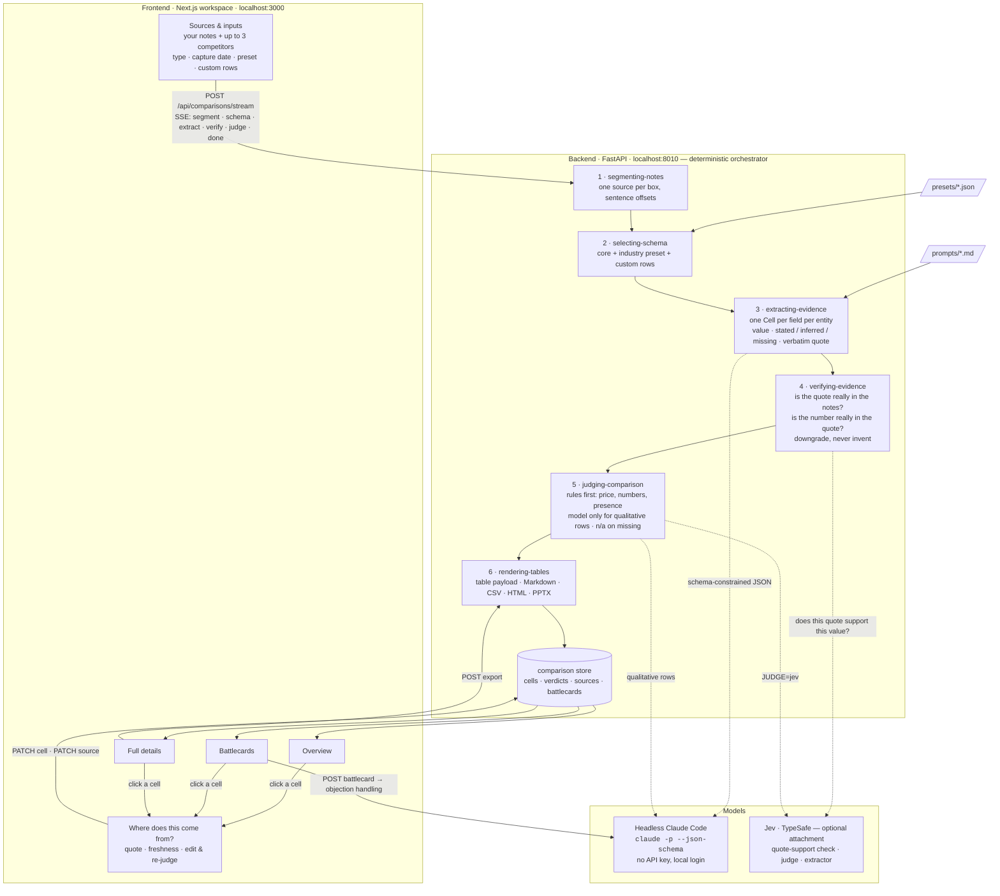
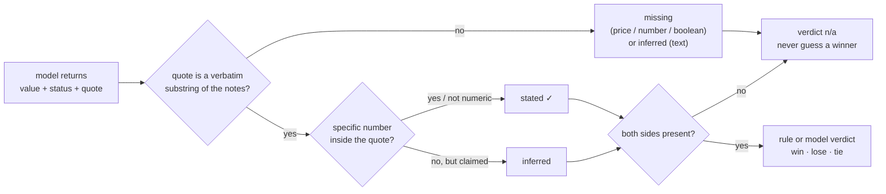

# Competitor Comparison Table

Turns rough competitor notes plus a description of your own company into a clean, traceable comparison table a
marketer or seller can drop into a deck. The table is honest by construction:

- every **Stated** cell carries a verbatim quote that a deterministic pass confirms is a real substring of the input,
- **Inferred** cells are labeled and explain their reasoning,
- gaps are flagged **Missing** instead of guessed,
- each competitor cell is marked **win / lose / tie / n-a** versus your company with a one-line rationale,
- exports to Markdown, CSV, HTML, and a PPTX slide.

## How it works



How one cell earns its label — the model proposes, code decides:



## Architecture

Deterministic orchestrator (`backend/pipeline.py`) that calls the model in exactly two places:

| # | Skill (`.claude/skills/*/SKILL.md`, symlinked as `skills/`) | Code | Model? |
|---|---|---|---|
| 1 | segmenting-notes | `pipeline.segment`, `text.sentences` | no |
| 2 | selecting-schema | `pipeline.select_schema` + `presets/*.json` | no |
| 3 | extracting-evidence | `llm.extract` | **yes** – headless Claude, JSON-schema constrained |
| 4 | verifying-evidence | `pipeline.verify` / `normalize` | no (optional Jev support check) |
| 5 | judging-comparison | `pipeline.rule_verdict`, `llm.judge` | rules first; model only for qualitative rows |
| 6 | rendering-tables | `export.py`, `frontend/components/ComparisonTable.tsx` | no |

**Model backend = a headless Claude Code session.** `backend/llm.py` shells out to
`claude -p --tools "" --json-schema <schema> --system-prompt <prompt>` and reads `structured_output`. No API key is
needed; it uses your local Claude Code login. Set `CLAUDE_MODEL=sonnet` for faster/cheaper runs.

**Jev is an optional attachment** (`backend/jev.py`, enabled when `TYPESAFE_API_KEY` is set). Jev returns calibrated
judgments rather than text, so it attaches where a judgment is needed:

- `support_check` – after the substring check, asks "does this quote actually support this value?" and downgrades
  stated cells on a confident no (on by default when the key is present);
- `JUDGE=jev` – win/lose/tie for qualitative rows as a Choice with Jev's own confidence;
- `EXTRACTOR=jev` – select-not-generate extraction fallback: Jev picks the supporting sentence per field, code copies
  the quote, so evidence is verified by construction.

## Run it

```bash
# backend (Python 3.12+; .venv already has the deps, or: uv pip install -e '.[dev]')
cp .env.example .env         # optional: TYPESAFE_API_KEY, CLAUDE_MODEL
python main.py               # http://localhost:8010  (needs `claude` on PATH and logged in)

# frontend
cd frontend && npm install && npm run dev   # http://localhost:3000
```

Open http://localhost:3000. The UI is a single workspace with four tabs, built on the Industry design system from
the Claude Design project and the structure of the product mockup (`Mockup.pdf`):

- **Sources & inputs** — source register (type, capture date, freshness), notes pasted by hand for your company and up
  to three competitors (each block tagged Public / Internal / Notes with a capture date), industry preset and custom
  rows, Generate. The "Connected data sources" panel (HubSpot, Confluence, web monitor, …) is a concept only and is
  marked as such; nothing behind it is implemented.
- **Overview** — the same verified cells grouped like the mockup: company basics side by side, key features as
  green check / red cross / amber inferred / dash not-in-notes, pricing and numbers with the win / lose badge.
- **Battlecards** — per competitor: stat tiles, "Where you win / Where they genuinely win" derived from the verdicts,
  gaps the notes can't settle, and objection handling drafted on demand by headless Claude from the compared values
  only (`POST /api/comparisons/{id}/battlecard/{entity_id}`, cached on the comparison). Copy as Markdown.
- **Full details** — the evidence-first table with the stats strip, stage progress, status badges and tints.

Click any cell anywhere for **Where does this come from?**: value, verdict, and the dated source block with verbatim
quotes; mark the source outdated or confirm it still valid (`PATCH /api/comparisons/{id}/source`), edit the cell and
re-judge the row. Freshness rules: fresh under 30 days, aging 30 to 90, stale over 90 or marked outdated; cells from
stale sources carry a tag in every table.

The design system's CSS is ported verbatim to `frontend/app/industry.css`; dark-mode tokens, semantic colors and the
workspace classes live in `frontend/app/globals.css`.

## API

- `POST /api/comparisons` – run the pipeline, returns `{comparison, verification_report}`
- `POST /api/comparisons/stream` – same, as server-sent events: `segment, schema, extract, verify, judge, done`
- `PATCH /api/comparisons/{id}/cell` – edit one cell and re-judge that row
- `PATCH /api/comparisons/{id}/source` – mark a source outdated / confirm still valid (re-dates it)
- `POST /api/comparisons/{id}/battlecard/{entity_id}` – draft objection handling for one competitor (headless Claude)
- `POST /api/comparisons/{id}/export` – `{"format": "markdown" | "csv" | "html" | "pptx"}`
- `GET /api/presets`, `GET /api/examples`, `GET /api/health`

Schemas: `schemas/*.json` (generated from `backend/models.py` via `python -m backend.models`).

## Tests

```bash
.venv/bin/python -m pytest -q                       # offline: numeric rules, verifier, pipeline with scripted fakes
RUN_LIVE=1 CLAUDE_MODEL=sonnet .venv/bin/python -m pytest tests/test_live.py -s   # fixtures through real models
```

The live suite logs the plan's metrics per fixture (fabrication rate, downgraded cells, rejected quotes, sparse
gap-flag recall) and asserts: fabrication rate 0, `$8 < $12 → win`, inferred "cheaper" → n/a, silent notes → n/a,
prompt injection cannot flip the price verdict, conflicting prices and currency mismatches → n/a.

## Design notes and known simplifications

- Verdicts are always from your company's point of view. If **either** side is Missing the verdict is n/a; the plan's
  worked example showed "lose: they have it, you unspecified", which contradicts its own "never guess on missing
  data" rule, so the rule wins here.
- Prices are normalized per month in code; a price with no period keyword is assumed monthly (noted on the cell).
- Comparisons live in memory (`STORE`); add SQLite when saved comparisons / versioning matter.
- Notes are capped at 200 sentences per box and 3 competitors per run.
- Model confidence is shown bucketed (high / medium / low) and never gates logic; the deterministic verifier does.
